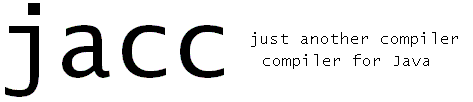

# jacc

Copyright Mark P Jones, Portland State University, 2004-2016.

This repository provides a copy of the source code for jacc, just another
compiler compiler for Java.  The materials here were imported from
the [jacc homepage](http://web.cecs.pdx.edu/~mpj/jacc) and are 
made available here as free software under the GPL 3.0 license.

# Overview
jacc is a parser generator for [java](http://java.sun.com).  But there
are already several other parser generators for Java, including CUP,
Antlr, JavaCC, SableCC, Coco/R, BYACC/Java, and the Jikes Parser Generator.
So why would somebody write yet another one, and why might you want to use it?

In short, what makes jacc different from other
tools is its combination of the following features:

- Close syntactic compatibility with
  Johnson's classic yacc parser generator for C
  (in so far as is possible given that the two tools target
  different languages);

- Semantic compatibility with yacc:
  jacc generates bottom-up/shift-reduce parsers for LALR(1)
  grammars with disambiguating rules;

- Implemented in pure Java, so it is
  portable and runs on many Java development platforms;

- Modest additions to help users understand and debug
  generated parsers, including: a feature for tracing
  parser behavior on sample inputs, HTML output, and
  tests for LR(0) and SLR(1) conflicts;

- Primitive support for distributing grammar descriptions
  across multiple files to support modular construction
  or extension of parsers;

- A mechanism for generating syntax error messages
  from examples based on ideas described
  by [Clinton Jeffery](http://unicon.sourceforge.net/merr/);

- Generated parsers that use a technique
  described by Bhamidipaty and Proebsting for creating
  very fast yacc-compatible parsers by generating code
  instead of encoding the specifics of a particular
  parser in a set of tables as the classic yacc
  implementations normally do.

So, if you are looking for a yacc-compatible
parser generator for Java, then perhaps jacc may meet your needs!

# Installation
Installation of this software requires a suitable Java development
kit as well as a copy of ant.  I have used these instructions with
a variety of different Java versions on a variety of different
platforms.

To build, use the command `ant` (or `ant jacc`, if you prefer).
This will create a file `jacc.jar` in the `dist/` folder that you
should move to a suitable directory on your machine.  After this:

- On Windows:
  Copy the batch file `scripts/jacc.bat` to a directory on your path.
  You should edit this file so that the string `%JACC_PATH%` is
  replaced with the absolute path of the directory containing
  `jacc.jar` (or else set the environment variable `JACC_PATH` to
  point to that directory).

- On Unix:
  Copy the file `scripts/jacc` to a directory on your path.
  You should edit this file so that the string `$JACC_PATH` is
  replaced with the absolute path of the directory containing
  `jacc.jar` (or else set the environment variable `JACC_PATH`
  to point to that directory).

After the appropriate files have been installed, you can use the command
`ant clean` to delete temporary files that were constructed during the
installation process.

# History
jacc was written by Mark P Jones at the end of 1999 for use in his
class on compiler construction at the beginning of 2000.  It has been
used in several different classes and projects since then, but has not
yet been widely distributed.  Comments and suggestions that might help
to improve either the tool or the documentation are always welcome!

# License
Early attempts to obtain approval for open source distribution of jacc
were delayed for many years.  This version, corresponding very closely
to the original distribution from April 2004 but with the addition of
extra code for generating dot descriptions of generated machines, is
distributed under a GPL license; please see the file LICENSE for more
details.

# Known issues
This version of jacc has been in use for many years and is believed
to work well in most cases.  There is, however, a known issue in the
treatment of `%nonassoc` directives that will be fixed in a future
update.
